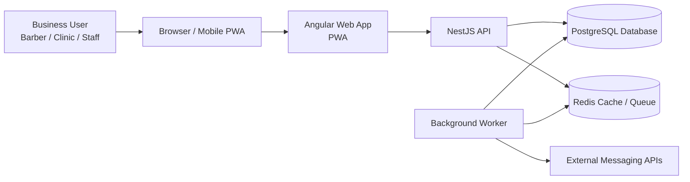
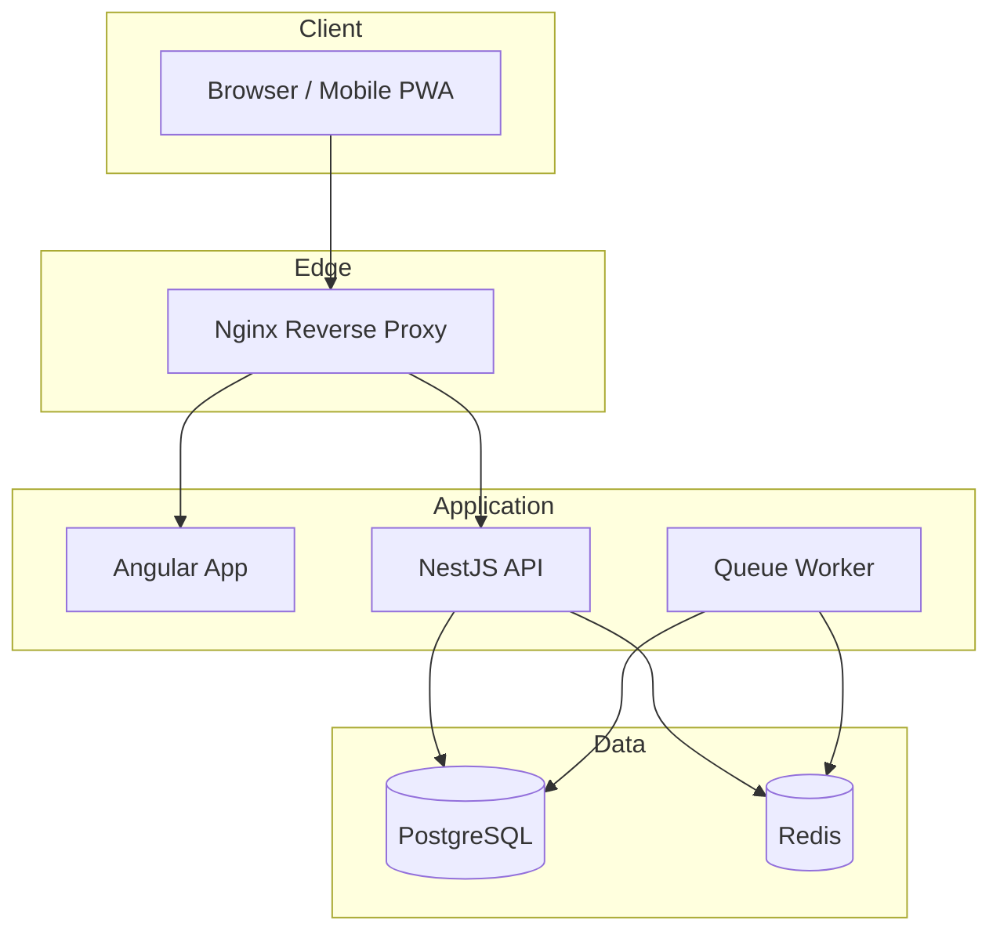
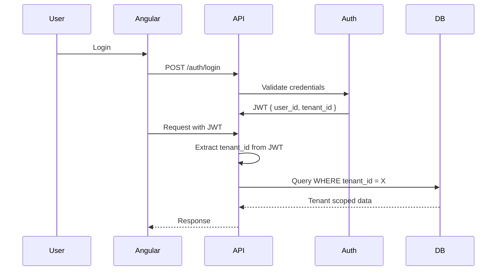
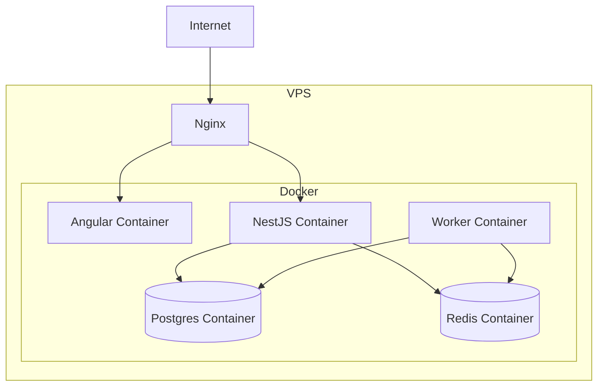
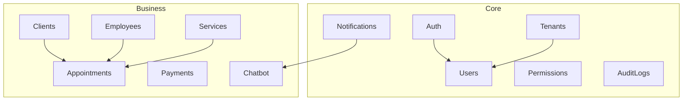

# Architecture — RomaWorks Platform

## 1. Overview

RomaWorks Platform is a multi-tenant SaaS core platform designed to support multiple products created by RomaWorks.

The first product built on top of this platform is:

**RomaSchedule** — a scheduling and customer relationship product for small service businesses such as:

- barbershops
- beauty salons
- aesthetic clinics
- tattoo studios
- small practices and consultancies

The platform is designed to be:

- simple to operate in the beginning
- low-cost in infrastructure
- secure in tenant isolation
- extensible for future RomaWorks SaaS products

---

## 2. Main Goals

The platform must provide reusable building blocks for future products, including:

- authentication
- tenant management
- user and permission management
- customer management
- scheduling
- notification and chatbot automation
- audit logs
- future billing support

---

## 3. Technology Stack

### Frontend
- Angular
- Angular Material
- PWA support
- Mobile-first design

### Backend
- Node.js
- NestJS
- REST API

### Database
- PostgreSQL

### Cache / Queue
- Redis

### Infrastructure
- Docker
- Nginx
- Single VPS for MVP

---

## 4. High-Level Architecture

```text
Browser / Mobile PWA
        ↓
     Nginx
        ↓
  Angular Frontend
        ↓
   NestJS REST API
        ↓
 PostgreSQL + Redis
        ↓
    Background Workers
```

---

## Initial Containers

- nginx

- web

- api

- worker

- postgres

- redis

This architecture is intentionally simple for the MVP and first paying customers.

---

## 5. Multi-Tenancy Strategy

RomaWorks Platform uses logical isolation with tenant_id.

## Core rule

Every business entity must contain:

- tenant_id (UUID)

### Examples:

- users

- clients

- employees

- services

- appointments

- notifications

- chatbot flows

## Tenant source

The tenant_id is extracted from the authenticated JWT token.

Example JWT payload:

```json
{
  "sub": "user_uuid",
  "tenant_id": "tenant_uuid",
  "role": "admin"
}
```

## Security rule

The backend must never trust tenant identifiers coming from the frontend request body or querystring.

Tenant context must always be derived from:

- JWT

- authenticated session context

---

## 6. Authentication and Authorization

### Authentication

Authentication is based on:

- email + password

- JWT access tokens

### JWT payload

Required fields:

- sub: user id

- tenant_id: tenant UUID

- role: user role

### Authorization

Initial RBAC model:

- owner

- admin

- manager

- employee

This role structure is enough for the first version of RomaSchedule.

Example:

- owner/admin can manage settings and employees

- manager can operate business workflows

- employee can view own schedule and interact with customers

## 7. Core Platform Modules

### Core Modules

These modules are reusable across all RomaWorks products:

- Auth

- Tenants

- Users

- Roles / Permissions

- Notifications

- Audit Logs

- Integrations

- Feature Flags (future)

- Billing (future)

### Business Modules

Initial product modules:

- Clients

- Employees

- Services

- Appointments

- Payments

- Chatbot / Automation

## 8. Initial Folder Strategy

romaworks-platform/
├── docs/
├── apps/
│   ├── api/
│   └── web/
├── infra/
│   ├── docker/
│   ├── nginx/
│   └── scripts/
├── .env.example
├── docker-compose.yml
└── README.md

### Backend structure

Suggested initial structure for NestJS:

apps/api/src
├── core
│   ├── auth
│   ├── tenants
│   ├── users
│   ├── permissions
│   ├── notifications
│   └── audit
├── modules
│   ├── clients
│   ├── employees
│   ├── services
│   ├── appointments
│   ├── payments
│   └── chatbot
└── common

### Frontend structure

Suggested initial structure for Angular:

apps/web/src/app
├── core
├── shared
├── features
│   ├── auth
│   ├── dashboard
│   ├── clients
│   ├── appointments
│   ├── employees
│   ├── services
│   └── settings

---

##  9. Database Design Principles

### Key principles

- Use UUIDs for primary keys

- Use tenant_id in every business table

- Use timestamps in core entities

- Prefer explicit relational modeling

- Keep schema simple for MVP

### Initial core entities

- tenants

- users

- roles

- permissions

- clients

- employees

- services

- appointments

- notifications

- audit_logs

### Example table fields

Appointments:

- id

- tenant_id

- client_id

- employee_id

- service_id

- start_at

- end_at

- status

- created_at

- updated_at

## 10. API Design Principles

### General style

- REST API

- versioned routes

- DTO validation

- explicit error handling

Example route style

GET /api/v1/clients

POST /api/v1/appointments

PATCH /api/v1/services/:id

### Validation

All incoming request payloads must be validated using DTOs.

## 11. Notification and Chatbot Strategy

A reusable RomaWorks notification and automation layer will be built to support:

- appointment confirmation

- reminder messages

- reactivation campaigns

- follow-up communication

- future WhatsApp integrations

### Initial design

The first version should support:

- internal event creation

- queue-based message processing

- simple worker execution

### Channels

Initial / phased channels:

- email

- WhatsApp (future integration)

- SMS (future integration)

- push notifications (future)

## 12. Worker Architecture

Background processing should be isolated from the main API.

### Worker responsibilities

- process notifications

- process chatbot flows

- execute delayed jobs

- handle retries

### Queue strategy

Redis will be used initially for:

- caching

- job queues

- lightweight asynchronous workflows

## 13. Frontend Principles

### UX goals

The product must work very well on mobile because users may include:

- barbers

- tattoo artists

- front-desk attendants

- business owners away from desks

### Frontend goals

- mobile-first

- responsive layout

- few-click workflows

- PWA installability

- good performance on low-end devices

## 14. Infrastructure Strategy

### Initial strategy

Use a single VPS to keep operational costs very low until first customers arrive.

Why

At the current stage, priorities are:

- product validation

- customer acquisition

- fast iteration

- low operational burden

### Initial services on the VPS

- Nginx

- Angular frontend

- NestJS backend

- PostgreSQL

- Redis

- Worker

### Risks accepted initially

- single point of failure

- limited horizontal scalability

These are acceptable for the MVP phase.

## 15. Observability and Reliability

Initial reliability measures:

- Dockerized services

- restart policies

- Postgres persistent volume

- Redis persistent volume

- environment-based configuration

Near-future additions:

- database backups

- uptime monitoring

- application logs

- health checks

## 16. Scaling Path

### Stage 1

Single VPS with all services.

### Stage 2

Split database from application server.

### Stage 3

Multiple app instances + external managed database.

### Stage 4

More advanced orchestration if business justifies it.

Scaling should only happen when usage demands it.

## 17. Non-Negotiable Architectural Rules

1. Every business entity must contain tenant_id.

2. tenant_id must be UUID.

3. Tenant context must come from JWT, never from frontend input.

4. Backend services must enforce tenant filtering.

5. Code should prioritize maintainability over premature complexity.

6. Infrastructure must stay simple until paying customers justify more complexity.

7. Background jobs must not block request/response flows.

8. Mobile experience is a first-class requirement.

## 18. First MVP Scope

The MVP should include:

- authentication

- tenant creation / onboarding

- user management

- clients

- employees

- services

- appointments

- basic dashboard

- basic notifications foundation

- mobile-friendly frontend

Everything else should be phased in after first validation.

## 19. Future Products on the Same Core

The architecture is intentionally designed so the same core can power:

- RomaSchedule

- RomaChat

- RomaDesk

- future CRM / internal tools / niche SaaS products

This is the strategic reason for building a core platform rather than a single isolated product.

## Flowcharts

### System Context Diagram (C4 - alto nível)


### Container Architecture (C4 - nível 2)


### Multi-Tenant Security Flow


### Infrastructure Diagram (VPS)


## Backend Module Architecture
